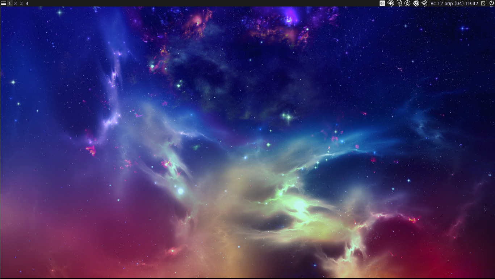

# Awesome WM



## Requirements

- terminator

- rofi

- flameshot

- xbacklight / xrandr

- amixer

## Links

[AwesomeWM DOC](https://awesomewm.org/doc/api/index.html)

[AwesomeWM GIT](https://github.com/awesomeWM/awesome)

[Awesome WM complements](https://github.com/lcpz/lain)

[Origin](https://github.com/lcpz/awesome-copycats)

## Development

### Debug

```sh
# Start Xephyr server
Xephyr -ac -nolisten tcp -br -noreset -screen 1600x850 :1
# Check syntax
awesome -k -c ./rc.lua
# Start AwesomeWM
DISPLAY=:1.0 awesome -c ./rc.lua

```
